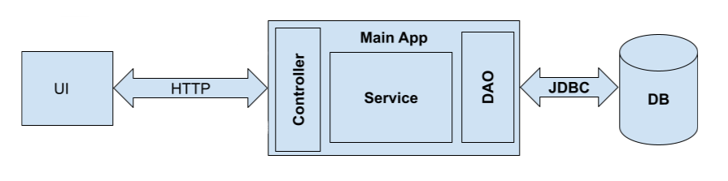

## **Practical task**
### Employee CRUD App
#### _Project description:_
Simple web application, that realizes an employee database with "CRUD" operations. The application has the next architecture:  
  
### The technologies are used in the app:
- Backend part ("Main app"):
    - Java 8;
    - Spring Framework (_Web MVC_);
    - Spring Test, JUnit 4, Mockito (_for tests_);
    - Spring JDBC (_as link to a database_);
    - Jackson (_as object serializer/deserializer to JSON_);
    - Servlets API;
    - Tomcat 7 embedded (_as a servlet container_) 
- Frontend part ("UI"):
    - HTML with JSP (a bit);
    - Javascript (JQuery, AJAX) (_for the DOM manipulating and requests to the backend part_).
- Database ("DB"):
    - PostgreSQL (_"production"_);
    - H2 in embedded mode (_tests_).
- Build tool:
    - Maven
### Launch instructions:
1. The first step is to set up PostgreSQL database:
   - Database schema should be created according to this [script](https://github.com/MSurmach/simplewebapp/blob/master/src/main/resources/db/migration/V1.1_Schema.sql);
   - Optional: you can fill up db by this [filler script](https://github.com/MSurmach/simplewebapp/blob/master/src/main/resources/db/migration/V1.2_Fill_data.sql);
   - The configuration for the database is located under "src/main/resources/db.properties" path.
2. Launch application by "mvn tomcat7:run" (_maven plugin_) command in the source directory. 

### Visual part of the application (_Screenshots_)
1. Root view:  
     
2. Find by id section:
   
3. See all section:  
     
3. Add new section:  
   

### Optional: also available operations upon employees (REST API):
 - GET  **/employees/all**   (_return all available employees from the database_);  
 - GET **/employees/{id}**   (return employee by ID);
 - POST **/employees** (saves a new employee, object transfers in the request body as JSON);
 - PUT **/employees** (updates an existed employee, object transfers in the request body as JSON);
 - DELETE **/employees/{id}** (deletes an employee by ID)/
   
   
   

        
        
  

